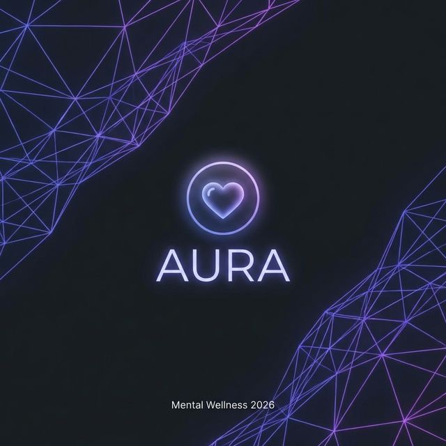

# 💜 GNS AURA — Your Futuristic Mental Health Companion



> **A secure, empathetic, and visually stunning space designed to understand your mind.**  
> Built with 2026 aesthetics and high-fidelity 3D interactions.

---

## ✨ Experience the Future of Wellness

GNS Aura is not just a tracker; it's a **digital sanctuary**. Integrating advanced AI with a calming, futuristic UI, Aura helps you navigate your emotions through deep-listening conversations, interactive grounding, and mindful journaling.

### 🌌 Core Modules

| Module               | Description                                                                           | Aesthetic         |
| :------------------- | :------------------------------------------------------------------------------------ | :---------------- |
| **Aura AI Chat**     | An empathetic AI assistant that listens and provides therapeutic insights using LLMs. | Futuristic Glow   |
| **Dynamic Wellness** | Interactive 3D exercises including Box Breathing and Body Scans.                      | Vanta.js Animated |
| **Field Journal**    | Secure, locally encrypted thoughts with AI-generated mood analysis.                   | Glassmorphism     |
| **Panic Protocol**   | A rapid-response 5-4-3-2-1 grounding technique for instant calm.                      | Cyber-Safety      |
| **Booking System**   | Seamlessly connect with professional therapists for deeper support.                   | Premium Silk      |

---

## 🇱🇰 Fully Localized for Sri Lanka

Aura speaks your language. We have implemented **full Sinhala (සිංහල) localization** across the entire platform, including:

- **Localized UI**: Every button, label, and instruction is available in Sinhala.
- **Sinhala AI Voice**: Integrated Text-to-Speech specifically tuned for Sinhala phonetics.
- **Culturally Tuned**: Support helplines and instructions tailored for the Sri Lankan context.

---

## 🛠️ Technical Ecosystem

- **Frontend**: [Quasar Framework](https://quasar.dev/) (Vue 3, Vite, Pinia)
- **Visuals**: [Vanta.js](https://www.vantajs.com/) (3D Network Meshes), [Three.js](https://threejs.org/)
- **Backend**: [FastAPI](https://fastapi.tiangolo.com/) + [Uvicorn](https://www.uvicorn.org/)
- **Intelligence**: [LangChain](https://www.langchain.com/) + DeepSeek AI
- **I18n**: Vue-I18n for English & Sinhala parity

---

## 🚀 Quick Start

### 1. Prerequisites

- Node.js (v20+)
- Python (v3.10+)

### 2. Backend Setup

```bash
cd backend
pip install -r requirements.txt
python -m uvicorn main:app --reload
```

Set up your `.env` in the root:

```env
DEEPSEEK_API_KEY=your_key_here
```

### 3. Frontend Setup

```bash
# Install dependencies
npm install

# Start development mode
npm run dev
```

---

## 🔒 Zero-Knowledge Guarantee

Aura enforces **strict on-device data sovereignty**. Your journals and chat history stay on your device. We do not store, view, or sell your psychological profile. Your mind is your own property.

---

_Created with 💜 by G.Nawod Sanjana_
